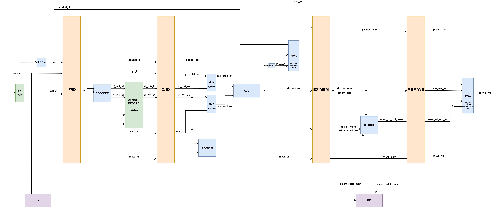

# 基于 LA32R 架构的 32 位五级流水线处理器与参数化 N 路组相连 Cache 的实现

**[English Version](./README.md)** | [中文版]

## 📌 项目概述

本项目包含一个基于 **LA32R (龙芯 32 位精简指令集)** 架构的 32 位五级流水线微处理器的完整 RTL 实现，以及一个独立、高度参数化的 **N 路组相联 Cache (高速缓存) IP**。整个项目采用 Verilog HDL 从零开始编写，是计算机体系结构从基础单周期数据通路向高性能、高鲁棒性流水线架构演进的核心体现。

该设计通过纯硬件机制（包括动态数据前递/旁路网络和智能的流水线阻塞/冲刷控制系统），完美地解决了复杂的结构冒险、数据冒险和控制冒险。整个微处理器已通过严格的行为级仿真，并成功综合、下板至 FPGAOL 平台进行物理真机测试；同时 Cache 模块也已通过搭载模拟主存延迟的严苛 Testbench 验证。

### 系统数据通路



>   **注：**上图展示了五级流水线的基准数据通路。为了保持架构图的清晰易懂，此处省略了已在 RTL 中实现的前递路径与冒险检测逻辑。

## 🚀 核心架构特性

### CPU 核心特性

-   **完整的五级流水线：** 实现了标准的取指 (IF)、译码 (ID)、执行 (EX)、访存 (MEM) 和写回 (WB) 五个独立阶段，最大化了时钟频率与指令吞吐率。
-   **动态数据前递/旁路：** 拥有独立的前递单元，通过将 ALU 或 MEM 阶段的最新输出直接短路路由至 EX 阶段，从根本上消除了写后读 (RAW) 数据冒险，将气泡插入降至最低。
-   **Load-Use 与控制冒险处理：** 集成了全局冒险检测单元 (`SegCtrl`)。在发生 Load-Use 冲突时智能阻塞流水线（冻结 PC 和 IF/ID 寄存器），并在分支跳转时精准冲刷错误预取的指令。
-   **写优先寄存器堆：** 在寄存器内部实现了写优先机制。若同一周期内对同一地址进行读写，直接输出即将写入的数据，从底层完美解决了 ID 与 WB 阶段的结构冒险。
-   **高级访存控制器：** 包含访存控制单元 (`SLU`)，支持非对齐内存访问，能够精确处理任意字节、半字、字的内存读写事务，并包含正确的符号/零扩展逻辑。
-   **板级硬件调试集成：** 无缝对接外设调试单元 (PDU)。能够在 FPGA 物理运行中，同步暴露并抓取 CPU 内部真实状态（如 `commit` 信号、PC、寄存器更新等）以供验证。

### 可配置 Cache IP 特性

-   **参数化 N 路组相联：** 支持动态配置为 2路、4路、8路和 16路组相联。*(出于对硬件映射效率和地址解码性能的考量，N 的取值被严格限制为 2 的幂次方)*。
-   **多样化替换策略：** 当 Cache 发生 Miss 且对应组已满时，支持通过热插拔的硬件模块进行行替换：
    -   **LRU (最近最少使用)：** 维护时间戳，淘汰最久未被访问的行。
    -   **FIFO (先进先出)：** 基于严格的分配顺序计数器进行轮转淘汰。
    -   **伪随机：** 以极低的硬件逻辑开销提供可接受的命中率。
-   **写策略：** 采用写回与写分配策略，最大化内存总线带宽利用率（字对齐访问）。
-   **物理内存延迟模拟：** 顶层通过 `mem.v` 显式模拟了真实物理主存的读写延迟（例如在仿真中配置为 5 cycles 惩罚，对应真实硬件中 50+ cycles 的物理延迟），以严苛测试流水线停顿机制。

## 📊 验证与性能报告

本项目对 CPU 核心与 Cache 子系统均进行了详尽的量化分析。详细的仿真波形图、命中率数据分析及性能测试见下表：

👉 **[点击此处查看详细的 CPU 流水线验证报告](./cpu_core/docs/CPU_Pipeline_Verification_Report.pdf)** 

👉 **[点击此处查看详细的 Cache 性能分析报告](./cache_module/reports/Cache_Performance_Analysis_Report.pdf)**

## 📂 项目结构与目录树

为了严格遵循现代硬件设计的工程规范，本代码库被清晰地划分为两个独立的子系统：

```
LA32R-Pipelined-Processor-with-Cache/
├── README.md                  # 项目核心说明文档
├── LICENSE                    # 开源协议
├── cpu_core/                  # 子目录 1: 五级流水线 CPU 核心
│   ├── src/                   # CPU 设计源码
│   │   ├── CPU.v              
│   │   ├── PipelineTop.v      
│   │   ├── PipelineReg.v      
│   │   ├── Forwarding.v       
│   │   ├── SegCtrl.v          
│   │   ├── PC.v               
│   │   ├── Decoder.v          
│   │   ├── RegFile.v          
│   │   ├── ALU.v              
│   │   ├── Branch.v           
│   │   ├── SLU.v              
│   │   └── MUX2.v             
│   └── docs/                  # 架构图纸与 FPGA 物理下板照片
│       ├── datapath.png    
│		└── CPU_Pipeline_Verification_Report.pdf
└── cache_module/              # 子目录 2: 高速缓存 Cache IP
    ├── src/                   # Cache 设计源码
    │   ├── simple_cache.v     
    │   ├── lru_eviction.v     
    │   ├── fifo_eviction.v    
    │   └── random_eviction.v  
    ├── sim/                   # 仿真与测试环境
    │   ├── mem.v              
    │   ├── bram.v   
    │   ├── generate_tb.v 	   # 生成测试文件 mem_bram.v 和 cache_tb.v
    │   ├── mem_bram.v  
    │   └── cache_tb.v         
    └── reports/               # 验证报告与性能分析波形图
        └── Cache_Performance_Analysis_Report.pdf
```

## 🧩 模块架构与 Verilog 源文件详解

### 1. CPU 核心模块

**第一层：顶层互联与流水线主干**

1.  **`CPU.v` (系统顶层封装)：** 整个 CPU 的最高层。它负责实例化并连接所有数据通路模块、`PipelineTop` 以及存储器接口。它不仅路由贯穿 5 个阶段的信号，还负责锁存用于 PDU 调试的 `commit` 信号。
2.  **`PipelineTop.v` (流水线大动脉)：** 集中化的流水线寄存器管理器。它将所有零碎的级间寄存器封装在一起，统一接收和分配全局的 `stall` 与 `flush` 信号，确保数据和控制信号从 IF 平稳流向 WB。
3.  **`PipelineReg.v` (统一级间寄存器)：** 高度参数化的四级移位寄存器模块。作为各流水段的物理存储边界，具备同步阻塞 (`stall`，保持原值) 和同步冲刷 (`flush`，复位清零) 功能。

**第二层：冒险解决与逻辑控制**

1.  **`Forwarding.v` (数据前递旁路单元)：** 实时监控 EX 阶段的源操作数寄存器 (`rf_ra0_EX`, `rf_ra1_EX`) 与 MEM、WB 阶段的目的寄存器地址。一旦发现匹配，立即打通旁路，将最新的计算结果直接“短路”至 ALU 输入端。
2.  **`SegCtrl.v` (冒险检测与段间控制单元)：** 实际上是全局冒险检测中心。它负责侦测 Load-Use 数据依赖以及分支跳转结果，据此向 `PipelineTop` 和 `PC` 发出精准的 `stall` 和 `flush` 控制指令。

**第三层：数据通路与执行部件**

1.  **`PC.v` (程序计数器)：** 位于 IF 阶段，保存当前指令地址。支持流水线停顿 (`stall`) 和跳转 (`flush`)，复位地址被硬编码为标准的 `32'h1C000000`。
2.  **`Decoder.v` (指令译码器)：** 位于 ID 阶段。负责解析 32 位 LA32R 机器码，提取寄存器地址、立即数（并做正确的符号扩展），生成驱动 ALU、访存及各路数据选择器的底层控制信号。
3.  **`RegFile.v` (寄存器堆)：** 包含 32 个 32 位通用寄存器。其代码亮点在于内部集成了“写优先”判断逻辑以从底层解决同一周期的结构冒险。
4.  **`ALU.v` (算术逻辑单元)：** EX 阶段的计算核心。执行所有的加减法、位逻辑（与、或、异或）、移位操作以及精确的有符号/无符号大小比较判定。
5.  **`Branch.v` (分支判定单元)：** 利用经过前递处理的操作数，在 EX 阶段对分支条件（如 BEQ, BNE, BLT 等）进行运算比对。如果跳转成立，负责通知 `PC` 改变地址并通知 `SegCtrl` 冲刷错误流水线。
6.  **`SLU.v` (访存控制单元)：** 位于 MEM 阶段。根据内存地址的低位和指令类型，生成正确的掩码并处理数据的截断与拼接，完美实现字节 (`ld.b/st.b`) 和半字 (`ld.h/st.h`) 内存操作。
7.  **`MUX2.v` (数据选择器)：** 基础且高频使用的参数化多路选择器。代码实现为 4选1 的数据选择逻辑，用于在数据通路中路由各类源数据。

### 2. Cache 与存储器模块

| **模块名称**            | **功能描述**                                                 |
| ----------------------- | ------------------------------------------------------------ |
| **`simple_cache.v`**    | Cache 核心控制器状态机与数据通路，处理读写请求、命中/未命中判断以及内存接口交互。 |
| **`lru_eviction.v`**    | 替换逻辑模块，使用时间戳 (Age) 实现 LRU (最近最少使用) 策略。 |
| **`fifo_eviction.v`**   | 替换逻辑模块，使用分配计数器实现 FIFO (先进先出) 策略。      |
| **`random_eviction.v`** | 替换逻辑模块，实现低硬件开销的伪随机替换策略。               |
| **`mem.v` / `bram.v`**  | 模拟主存后端与底层块 RAM，通过注入真实的读写延迟周期以进行全面测试。 |

## 🛠 开发环境

-   **硬件描述语言：** Verilog HDL
-   **综合与仿真工具：** Xilinx Vivado

-   **硬件部署平台：** FPGAOL 在线实验平台 (ZYNQ / Artix-7 系列)
